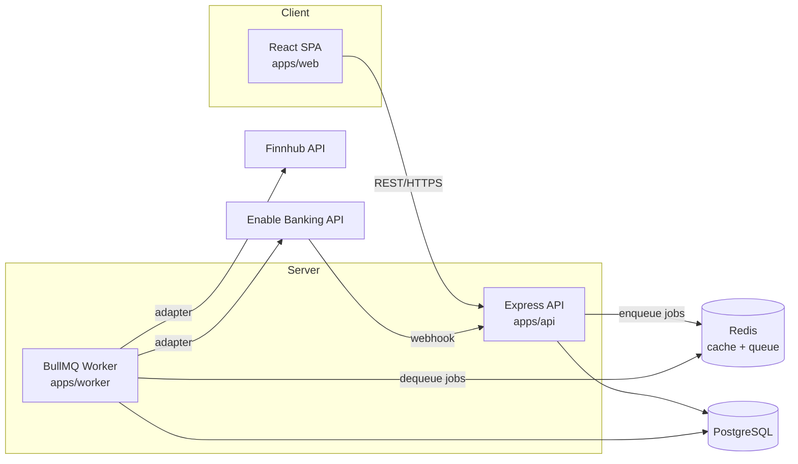

# Tsunade — Architecture

Tsunade is a personal finance and wealth management web app: transaction ledger (via Enable Banking or
manual CSV import), automatic categorization, manual and market-based asset valuations, and
net-worth/cash-flow analytics, delivered as a managed cloud service.

## Tech stack

| Layer                 | Choice                                                                                                                                                                | Why                                                                                                                                                                                                                                                                                                                                                                     |
| --------------------- | --------------------------------------------------------------------------------------------------------------------------------------------------------------------- | ----------------------------------------------------------------------------------------------------------------------------------------------------------------------------------------------------------------------------------------------------------------------------------------------------------------------------------------------------------------------- |
| Backend               | Node.js + Express (REST)                                                                                                                                              | Simple, well-understood REST surface; matches the worker split below.                                                                                                                                                                                                                                                                                                   |
| Frontend              | React + Vite + Tailwind CSS + TanStack Query                                                                                                                          | SPA over a separate API; no SSR needed, so Vite over Next.js. TanStack Query owns server-state caching/refetch.                                                                                                                                                                                                                                                         |
| Charting              | Recharts                                                                                                                                                              | Cash-flow and net-worth visualizations; React-native API, no separate rendering runtime.                                                                                                                                                                                                                                                                                |
| ORM / DB access       | Drizzle ORM                                                                                                                                                           | SQL-first, no generated-client build step, near-instant cold start. Migrations via `drizzle-kit`.                                                                                                                                                                                                                                                                       |
| Primary datastore     | PostgreSQL                                                                                                                                                            | Relational fit for accounts/transactions/ledger entries.                                                                                                                                                                                                                                                                                                                |
| Cache + queue broker  | Redis                                                                                                                                                                 | One instance, two uses: BullMQ's broker and short-TTL market-price caching.                                                                                                                                                                                                                                                                                             |
| Async processing      | BullMQ (separate `worker` process)                                                                                                                                    | Keeps the API responsive — Enable Banking syncs and market-data polling never block a request.                                                                                                                                                                                                                                                                          |
| External integrations | Enable Banking API, Finnhub (market data), exchangerate.host (exchange rates), behind adapter interfaces                                                              | `EnableBankingAdapter` / `MarketDataAdapter` / `ExchangeRateAdapter` abstract the real SDKs. `MarketDataAdapter`/`ExchangeRateAdapter` fall back to a fixture-backed implementation when the matching API key is unset; `EnableBankingAdapter` has no implementation yet — it's built against the real API directly, not a fixture, given the size of that integration. |
| Local development     | Docker Compose (`api`, `worker`, `web` — Nginx serving the built SPA, `postgres`, `redis`)                                                                            | Boots the full stack locally with one command; not used in production.                                                                                                                                                                                                                                                                                                  |
| Deployment            | Terraform → Azure: Container Apps (`api`, `worker`, `web`) + Container Registry, PostgreSQL Flexible Server, Azure Managed Redis (`noeviction` for BullMQ), Key Vault | The only supported deployment target — run and operated by us as a hosted service; same container images as local Compose. Defined in `infra/`.                                                                                                                                                                                                                         |

## System overview



The frontend never talks to Postgres or Redis directly — only REST calls to the API. The API and
worker share the database and the Redis-backed queue, but neither imports the other's internals.

## Repo layout

```
apps/
  api/      Express REST API — routes, controllers, request/response schemas
  worker/   BullMQ workers — ingestion jobs, market-data polling jobs
  web/      React SPA — routes, components, TanStack Query hooks
packages/
  db/              Drizzle schema, migrations, shared DB client (imported by api + worker)
  shared/          Shared TS types (Transaction, Account, Holding, Asset, ...) (imported by api + worker + web)
  categorization/  Pure rule-matching logic (cleanDescription, matchRule), no DB/HTTP (imported by api, will be by worker)
infra/      Terraform for the Azure deployment
fixtures/   Synthetic market-data/exchange-rate inputs used by adapter stubs and tests
tests/      Cross-module tests
docs/       Design docs
```

## Data model

Owned by `packages/db` (Drizzle schema + migrations), consumed by `apps/api` and `apps/worker`.

| Entity              | Purpose                                                                                                                                                                                              |
| ------------------- | ---------------------------------------------------------------------------------------------------------------------------------------------------------------------------------------------------- |
| `User`              | A registered user; owns every resource below via a `userId` foreign key. Has a `baseCurrency` preference (`EUR` or `USD` for now, defaults to `EUR`) used as the default analytics display currency. |
| `RefreshToken`      | Hashed, rotating credential backing a login session (not a product entity — auth-only).                                                                                                              |
| `Account`           | An Enable Banking-linked or manual account (checking, brokerage, ...), owned by a `User`.                                                                                                            |
| `Transaction`       | A ledger entry belonging to an `Account`; a cleaned description and `Category`, tagged with `source` (`enable_banking` or `csv`), stored in its original currency.                                   |
| `Tag`               | User-defined, flat label attachable to transactions, independent of `Category`.                                                                                                                      |
| `TransactionTag`    | Join row attaching a `Tag` to a `Transaction` (many-to-many).                                                                                                                                        |
| `Category`          | User-defined, flat category used for spend/cash-flow analytics.                                                                                                                                      |
| `Rule`              | Stored matcher (description/amount pattern → `Category`) used by the categorization engine; data, not code, so it's user-editable.                                                                   |
| `Holding`           | A position (symbol, quantity, cost basis) inside an investment `Account`, in its original currency.                                                                                                  |
| `ValuationSnapshot` | Point-in-time market value of a `Holding`, written by the market-data polling job; basis for net-worth history.                                                                                      |
| `Asset`             | A manually tracked, non-liquid asset or liability (real estate, physical gold, a personal loan, ...) with a current value in its original currency.                                                  |
| `AssetValueLog`     | User-logged value adjustment for an `Asset` over time; the manual counterpart to `ValuationSnapshot`.                                                                                                |

`packages/shared` mirrors these as TS types for use across `api`, `worker`, and `web`.

Every entity other than `User` is scoped by `userId`, so one user's data is never visible to
another. Currency is stored at its original value on `Transaction`, `Holding`, and `Asset`;
conversion to a display currency happens at read time (see Analytics below), not at write time.
The display currency is the user's `baseCurrency` preference by default, optionally overridden
per-request via the analytics endpoints' `currency` query param.

## API design

`apps/api` exposes a versionless JSON REST surface, grouped by resource:

| Group              | Endpoints                                                                    | Notes                                                                                                                                                                                                   |
| ------------------ | ---------------------------------------------------------------------------- | ------------------------------------------------------------------------------------------------------------------------------------------------------------------------------------------------------- |
| Accounts           | `/accounts`                                                                  | CRUD for linked/manual accounts.                                                                                                                                                                        |
| Transactions       | `/transactions`, `/transactions/:id/tags`                                    | List/filter/edit ledger entries; category overrides; attach/detach tags.                                                                                                                                |
| Tags               | `/tags`                                                                      | Create/list/delete for user-defined transaction tags (no rename — renaming would retroactively relabel every tagged transaction).                                                                       |
| Categories & rules | `/categories`, `/rules`                                                      | Create/list/delete for categories (same no-rename rule as tags); full CRUD for categorization rules.                                                                                                    |
| Holdings           | `/holdings`                                                                  | Investment positions per account.                                                                                                                                                                       |
| Assets             | `/assets`, `/assets/:id/value-log`                                           | Manual non-liquid assets/liabilities and their value-adjustment history.                                                                                                                                |
| Imports            | `/imports/csv/preview`, `/imports/csv/commit`                                | Two-step, synchronous upload: `preview` parses the file and returns detected columns and sample rows; `commit` takes the file plus a user-supplied column mapping and writes rows tagged `source: csv`. |
| Analytics          | `/analytics/net-worth`, `/analytics/cash-flow`                               | Read-only aggregates computed directly from Postgres.                                                                                                                                                   |
| Webhooks           | `/webhooks/enable-banking`                                                   | Inbound only; not part of the resource surface above — enqueues an `enableBanking.sync` job and returns immediately.                                                                                    |
| Auth               | `/auth/register`, `/auth/login`, `/auth/refresh`, `/auth/logout`, `/auth/me` | Issues and refreshes JWTs, ends a session, and reads/updates the current user's own profile (`baseCurrency`); not part of the resource surface above.                                                   |

Auth is JWT-based and multi-user. Every route above except `/auth/*` and `/webhooks/enable-banking`
requires a valid JWT and scopes all reads/writes to the authenticated `userId`.

## Core capabilities → data flow

**Data ingestion — automated.** Enable Banking webhook hits `apps/api`, which enqueues an `enableBanking.sync` job
on BullMQ and returns immediately. `apps/worker` picks up the job, calls `EnableBankingAdapter` to fetch
raw transactions/balances, and writes them to Postgres via `packages/db`.

**Data ingestion — manual.** Handled synchronously in `apps/api`, no worker involved, in two
steps: `POST /imports/csv/preview` parses the file and returns detected columns and sample rows;
the user maps columns (Date, Amount, Merchant, ...) to `Transaction` fields in the UI, then
`POST /imports/csv/commit` writes the mapped rows with `source: csv`. Mapping is
user-configurable rather than fixed, since bank export formats vary.

**Ledger & rules engine.** Runs in `apps/api` against incoming transactions (from either
ingestion path): cleans descriptions, matches rules, and assigns categories. When a `Rule` is
created or edited, `apps/api` also re-applies it as a backfill pass — but **only over transactions
eligible for auto-categorization** (`categoryId IS NULL AND categoryIsManual = false`). A category,
once assigned — by a rule, or by the user via `PATCH /transactions/:id` (setting _or_ clearing it)
— is a ledger entry: it never gets silently cleared or reassigned by a later rule change or a
rule's deletion. `categoryIsManual` is what makes a user's explicit clear (`categoryId: null`)
stick — without it, a cleared transaction would look identical to a never-categorized one and could
be silently re-filled by the next rule write. The only way to change an already-categorized (or
explicitly-cleared) transaction is the user acting on it directly via `PATCH /transactions/:id`.
Rules are stored data, not hardcoded logic, so they're user-editable. `Transaction.amount` is
**signed** (expenses negative, income positive) — an `amount`-matching `Rule.pattern` must match
that sign, e.g. `-12.50` for a 12.50 expense, not `12.50`.

**Net worth & asset tracking.** Two independent value sources feed net worth: a repeatable BullMQ
job in `apps/worker` polls `MarketDataAdapter` on an interval for `Holding` prices (caches in
Redis, persists a `ValuationSnapshot`), while manual `Asset` entries get their value from
user-submitted `AssetValueLog` rows via `apps/api` — no worker or external API involved.

**Analytics.** `apps/api` exposes read endpoints (net worth, asset allocation, monthly cash flow)
that aggregate directly from Postgres. No separate analytics service — these are queries, not a
pipeline. Net worth aggregation converts each `Transaction`/`Holding`/`Asset` from its original
currency to a display currency at read time via `ExchangeRateAdapter`, rather than storing a
converted value, so a later-corrected historical rate doesn't require rewriting stored data.

## Module boundaries

- `apps/web` only calls `apps/api` over HTTP — no direct DB/Redis access.
- `apps/api` and `apps/worker` do not import each other's internals; they communicate only
  through Postgres (`packages/db`) and the BullMQ queues in Redis.
- External API credentials (Enable Banking, Finnhub, exchangerate.host) are never committed — `.env` only, adapters read
  from environment and fall back to fixtures when unset.
- Both `apps/api` and `apps/worker` depend on `packages/db` and `packages/shared`; those packages
  depend on nothing app-specific.
